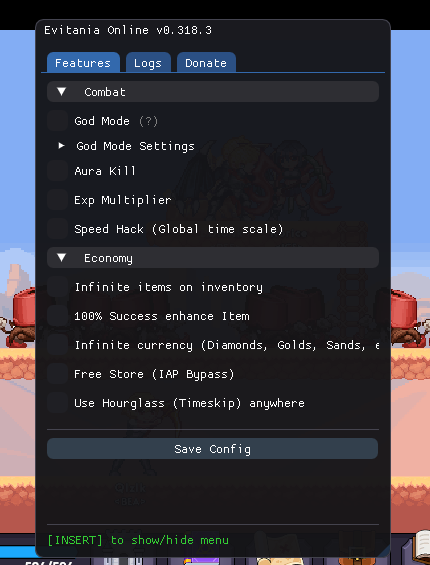

# Evitania Online

## Features

The architecture is strictly modularized into distinct feature categories located within the `src/Features/` directory.

 Image Preview 

### Combat

| Feature | Description |
|---|---|
| **God Mode** | Grants absolute invulnerability. Includes granular configuration for health points, custom damage multipliers, and unrestricted movement speed. |
| **Aura Kill** | Automatically neutralizes all hostile entities within the localized environment radius upon rendering. |
| **Exp Multiplier** | Modifies the experience point acquisition algorithm to exponentially accelerate leveling. |
| **Speed Hack** | Modifies the global `Time.timeScale` variable to accelerate animation execution, movement physics, and application loops. |

### Curio

| Feature | Description |
|---|---|
| **Always Legendary Curio** | guarantedd legendary tier of curio everytime gacha pull. |
| **Free Upgrade Curio** | upgrading curio needs 0. |

### Engineer
| Feature | Description |
|---|---|
| **Free Engineer Upgrades** | upgrading engineer needs 0. |

### Hunter
| Feature | Description |
|---|---|
| **Free Hunter Upgrades** | upgrading hunter needs 0. |

### Economy & Progression

| Feature | Description |
|---|---|
| **Infinite Items** | Intercepts inventory consumption subroutines to prevent asset depletion upon usage. |
| **100% Enhancement Success** | Hooks the item enhancement algorithm to enforce a guaranteed 100% success probability. |
| **Infinite Currency** | Nullifies subtraction routines for all premium and standard currencies (e.g., Diamonds, Gold, Sands). |
| **Free Store (IAP Bypass)** | Bypasses client-side in-app purchase (IAP) validation checks to acquire premium marketplace items without authorization. |

## Disclaimer

> I am not responsible for any actions taken by users of this cheat, including but not limited to violations of game terms of service or other regulations. Users should use this cheat at their own risk and be aware of the potential consequences.

## License
This project is licensed under the [MIT License](license).
